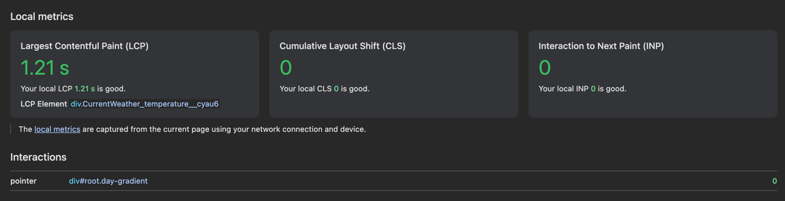
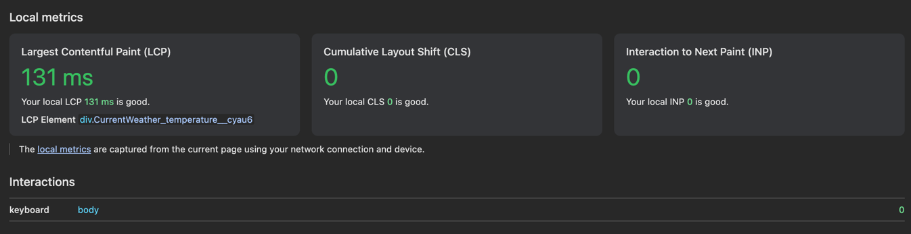
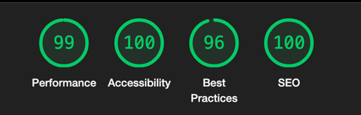

# Documentation

### Application structure
Application has 3 main sections:
- section with current weather condition (location name, current temperature, condition text and highest and lowest temperature for today)
- section with hourly forecast until next day
- section with 10-day forecast with precipitation probability and highest and lowest temperatures

### Used libraries
Besides `React`, I used `@tanstack/react-query` and `@tanstack/query-sync-storage-persister`

- `@tanstack/react-query` for efficient requests and smart refetching.
- `@tanstack/query-sync-storage-persister` for caching data to `localStorage` in order to use it offline.

### Technical solution explanation

#### React-query

I used `react-query` for efficient data management and caching data to local storage (with persister).

Main behaviour is the following - if there is data then we restore it and immediately expose to components,
otherwise request the data and expose to components.

Depends on the internet connection and cache age `react-query` decides refresh data or just wait internet connection
which allows use application in offline mode just with cache

#### Geolocation

App firstly tries to identify user's geolocation (and requests permission to geolocation) and then based on it fetch all data.
If user doesn't give the permission then App reports about an error with geolocation and provided retry button.
Last geolocation coordinates caches to localStorage and further requests will use that cache if the user turned on geolocation on the device.

I think it's not the best approach for this,
but based on my experience user ready to provide geolocation permission when he wants to get the weather forecast.

#### Error handling
I created `useErrorSubscription` custom hook to subscribe to any request error (when query cache changing).

The approach the following - if request has data and error happened then application ignores such error,
because `react-query` will care to refetch on mount or window focus every time but user still be able to see cached data.
Otherwise, such error considered to be shown to user along with retry button.

The advantage of approach is the user can see cached data even if the error happened,
but fresh data will be requested once user changes their focus.

#### Forecast data correction
I noticed that sometimes API returns current temperature outside the range for that day in forecast and user will see wrong forecast.
For that reason I created `useAdjustTemperatureRange` custom hook where on every fetching,
current temperature and first daily forecast compares and adjusted if needed.

I think the better solution is changing the API response on server, but this is not the case.

### Folder structure
I split files to meaningful folders for quick navigation and focusing. Here they are:

- `api` - all files related with API requests and data typing
- `components` - all React components placed here
- `constants` - only `index` file where all application constants located
- `hooks` - all custom react hooks located here. Every hook has JSDoc
- `icons` - all SVGs as react components located here
- `types` - some global and shared type definitions located here
- `utils` - utility functions located here. Every function has JSDoc

### PWA
I set up PWA with default manifest and simple service worker to cache application files and install as native application to device.
Service worker based on `onLine` navigator's flag decides to return cached file or request new one.

### Performance
Here some measurements of application performance

#### Web vitals with 4g preset without cache

#### Web vitals with 4g preset with cache

#### Lighthouse with 4g without cache

**4g preset which used above**: Download: 4000 Mbit/s, Upload: 3000 Mbit/s, Latency: 20ms
